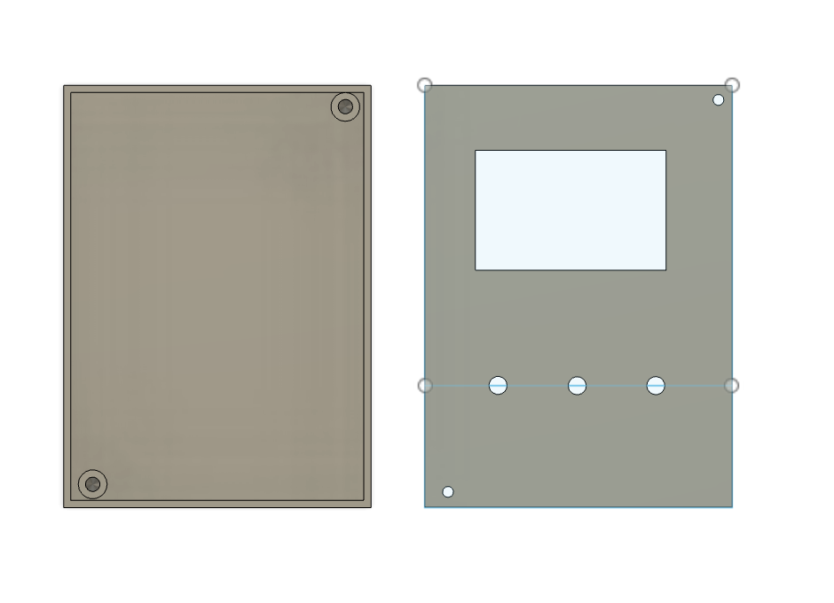
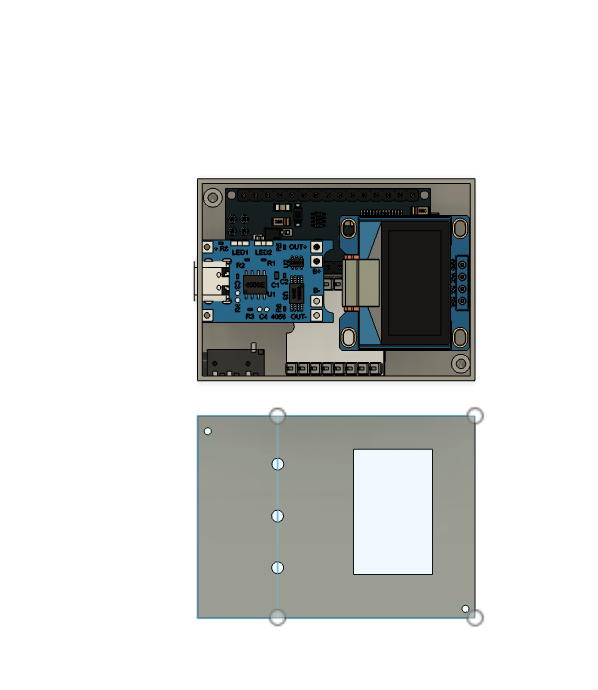

# Ardu_Mp3
Its an Arduino based mp3 player 

A compact DIY MP3 player built using Arduino Pro Mini, DFPlayer Mini, and an OLED display.
It features a custom UI, menu navigation, and physical button controls, making it a fully standalone embedded music player.(pcb not being use )

## Schematics

## CAD

## Assembly

## BOM
| Name | Purpose | Quantity | Total Cost (USD) | Link | Distributor |
|------|--------|----------|------------------|------|-------------|
| wired earphones | appuser | 1 | 2.42 | https://www.amazon.in/dp/B0CLP0T28U?ref=ppx_pop_mob_ap_share | amazon |
| 10 pin header | connectors | 1 | 4.00 | https://robu.in/product/ds1021-1x40sf11-b-connfly-1x40-pin-2-54mm-pin-header-v-t-type/?gQT=1 | robu |
| A2547W-02P-CWT 2.50mm 2 Pin Male Header ROHS | pin headers | 2 | 0.30 | https://robu.in/product/a2547w-02p-cwt-2-50mm-2-pin-male-header-rohs/ | robu |
| SanDisk Ultra 64GB microSDXC UHS-I Memory Card | memory | 1 | 10.25 | https://robu.in/product/sandisk-micro-sdxc-card-64gb-class-10-memory-card/ | robu |
| Arduino Pro Mini | module | 1 | 4.85 | https://robu.in/product/arduino-pro-mini-atmega328p-5v-16mhz/ | robu |
| DFPlayer Mini MP3 Player | module | 1 | 6.29 | https://robu.in/product/dfplayer-mini-mp3-player/ | robu |
| WLXK003 3.7V 300mAh LiPo Battery | battery | 1 | 1.75 | https://robu.in/product/300mah-3-7v-lipo-battery/ | robu |
| TP4056 Type-C Charging Module | charging module | 1 | 0.15 | https://robu.in/product/tp4056-type-c-usb-5v-lithium-battery-charging-module-with-current-protection-type-c/ | robu |
| 0.96 inch I2C OLED Display | display | 1 | 1.84 | https://robu.in/product/0-96-inch-i2c-oled-display-module-blue-yellow/ | robu |
| 5 x 7 cm Universal PCB Prototype Board | pcb | 1 | 0.47 | https://robu.in/product/5x7-cm-universal-pcb-prototype-board-double-side/ | robu |
