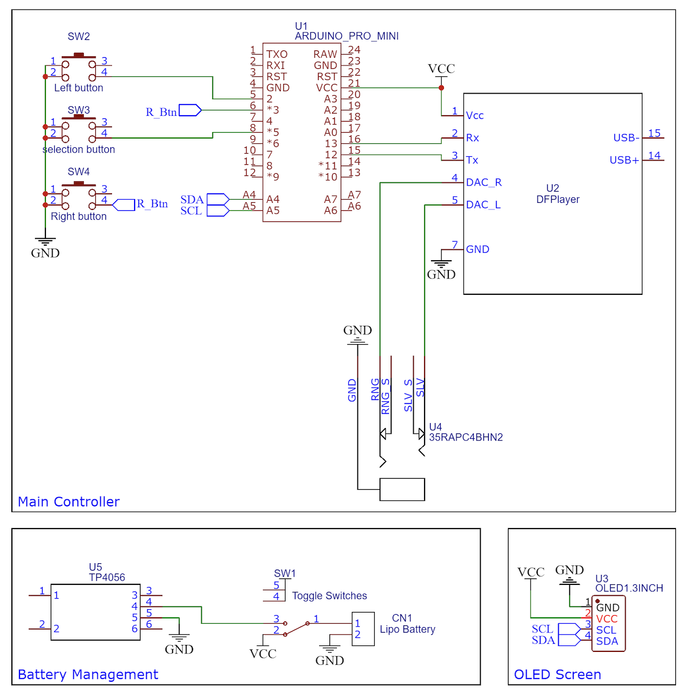

# Ardu_Mp3
Its an Arduino based mp3 player 

A compact DIY MP3 player built using Arduino Pro Mini, DFPlayer Mini, and an OLED display.
It features a custom UI, menu navigation, and physical button controls, making it a fully standalone embedded music player.(pcb not being use )

## Schematics

## BOM
## 🧾 Bill of Materials (BOM)

| S.No | Name | Description | Quantity | Category | Distributor |
|------|------|------------|----------|----------|-------------|
| 1 | SanDisk Ultra 64GB microSDXC UHS-I | 140MB/s R, Micro SD Card | 1 | Storage | Robu |
| 2 | Audio Jack PJ311 | 3.5mm Female Connector (Black) | 1 | Audio | Robu |
| 3 | DFRobot DFPlayer Mini | MP3 Player Module | 1 | Audio | Robu |
| 4 | WLY602030 LiPo Battery | 3.7V 300mAh 1S Micro Battery | 1 | Power | Robu |
| 5 | TP4056 Charging Module | Adjustable 1A Li-ion Charger | 1 | Power | Robu |
| 6 | OLED Display | 0.96" I2C 4-pin Blue Display | 1 | Display | Robu |
| 7 | Prototype PCB | 5x7 cm Double-sided Board | 1 | PCB | Robu |
